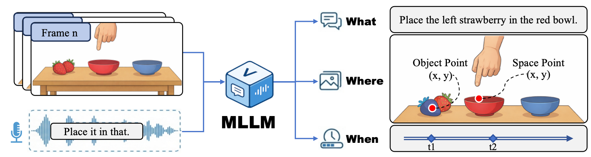

# Listening with the Eyes: Benchmarking Egocentric Co-Speech Grounding across Space and Time



This is the official repository for **EcoG-Bench**, as presented in the paper *"Listening with the Eyes: Benchmarking Egocentric Co-Speech Grounding across Space and Time"*.

[**中文版本 (Chinese Version)**](assets/README_zn.md)

---

## 🌟 Introduction

In situated collaboration, speakers often use intentionally underspecified deictic commands (e.g., *"pass me that"*), whose referent becomes identifiable only by aligning speech with a brief co-speech pointing **stroke**. 

**EcoG (Egocentric Co-Speech Grounding)** is a diagnostic benchmark designed to bridge the gap in existing multimodal benchmarks where language-only shortcuts often exist. In EcoG, grounding is executable only if an agent jointly predicts **What** (Intent), **Where** (Spatial Location), and **When** (Temporal Stroke).

### Key Features:
- **Comprehensive Dataset**: 811 egocentric clips across diverse environments (Industrial, Kitchen, Office).
- **Dense Annotations**: Millisecond-level stroke supervision and dense spatial masks.
- **Progressive Cognitive Evaluation**: A protocol that evaluates models across four levels of increasing complexity (L1–L4).
- **Bilingual Support**: Full support for both English (EN) and Chinese (ZH).

---

## 📂 Project Structure

```text
.
├── assets/                      # Static assets (images, documentation)
│   ├── task_info_en.md         # Detailed task definition (English)
│   └── task_info_zh.md         # Detailed task definition (Chinese)
├── data/                       # EcoG Dataset (English and Chinese subsets)
├── src/                        # Core Source Code
│   ├── data_loader.py          # Dataset loading utilities
│   ├── eval_engine.py          # Core evaluation engine logic
│   ├── gt_formatter.py         # Ground Truth formatting tools
│   ├── models/                 # VLM Wrappers (OpenAI, Gemini, DashScope, etc.)
│   ├── prompts/                # Prompt engineering & templates
│   ├── utils/                  # Video processing & logging utilities
│   └── eval/                   # Metrics implementation (Accuracy, Distance, etc.)
├── webui/                      # Web-based Management & Visualization System
│   ├── frontend/               # React-based frontend
│   └── backend/                # FastAPI-based backend service
├── results/                    # Directory for evaluation results
├── config.py                   # Global configuration management
├── main.py                     # Main entry for inference and evaluation
├── run_temporal_anchor_ablation.py # Script for temporal anchor ablation studies
├── requirements.txt            # Python dependencies
```

---

## 🚀 Quick Start

### 1. Installation

Python 3.9+ is recommended. Install the required packages:

```bash
pip install -r requirements.txt
```

For the WebUI, ensure you have Node.js installed:

```bash
cd webui/frontend && npm install
```

### 2. Configuration

Configuration is managed via `config.py` or a `.env` file.

1.  **Set up API Keys**: Create a `.env` file in the root directory:
    ```env
    OPENAI_API_KEY=your_openai_key
    GEMINI_API_KEY=your_gemini_key
    MODEL_PROVIDER=gemini
    MODEL_NAME=gemini-1.5-pro
    ```
2.  **Adjust Parameters**: You can modify `config.py` to change sampling FPS, number of workers, or input modalities (video vs. frames).

### 3. Running Evaluation

To run the standard benchmark evaluation:

```bash
python main.py
```

Results and logs will be saved in the `results/` directory.

---

## 🛠️ Advanced Features

### Web UI & Visualization

We provide a comprehensive Web UI to visualize model predictions, ground truth annotations, and manage evaluation tasks.

1.  **Start Backend**:
    ```bash
    cd webui/backend && python app.py
    ```
2.  **Start Frontend**:
    ```bash
    cd webui/frontend && npm run dev
    ```
3.  **Access**: Visit `http://localhost:5173` in your browser.

### Temporal Anchor Ablation

To reproduce the ablation studies regarding temporal cues:

```bash
python run_temporal_anchor_ablation.py
```
This script evaluates the model's performance under different conditions (e.g., without frame timestamps or without ASR word-level timing).

## 📊 Experimental Results

### Main Results on EcoG-Bench

| Model | L1 | L2 | L3 | L4 | Overall |
| :--- | :---: | :---: | :---: | :---: | :---: |
| **Native Omni Models** | | | | | |
| 🏆Gemini-3-Pro | 30.2 | 29.2 | 10.6 | 10.2 | 17.0 |
| Gemini-3-Flash | 12.2 | 10.2 | 3.2 | 6.6 | 7.0 |
| Qwen3-Omni-30B-A3B | 3.6 | 0.7 | 0.0 | 0.0 | 0.7 |
| Qwen3-Omni-Flash | 2.9 | 0.7 | 0.2 | 0.0 | 0.7 |
| **Vision-Language Models** | | | | | |
| Qwen3-VL-30B | 18.0 | 19.7 | 8.5 | 6.6 | 11.4 |
| Qwen3-VL-8B | 21.6 | 16.1 | 4.4 | 2.7 | 8.8 |
| GPT-5-mini | 5.0 | 2.9 | 2.8 | 3.2 | 3.3 |

> **Metric Definitions**:
> *   **Eco-Accuracy (eco)**: A referent is considered correct only if *What* (Intent), *Where* (Spatial), and *When* (Temporal) are all correctly grounded.
> *   **L1-L4**: Task complexity levels ranging from simple pointing to multi-step interactions.

---

## 📝 Citation

If you find this work useful in your research, please cite:

```bibtex
@article{ecog2025listening,
  title={Listening with the Eyes: Benchmarking Egocentric Co-Speech Grounding across Space and Time},
  author={Weijie Zhou, Xuantang Xiong, Zhenlin Hu, Xiaomeng Zhu, Chaoyang Zhao, Honghui Dong, Zhengyou Zhang, Ming Tang, Jinqiao Wang},
  journal={arXiv preprint},
  year={2025}
}
```

## 📄 License
This project is licensed under the [MIT License](LICENSE) (or specify your license).
